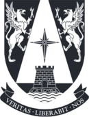

# MIA_ReinforcementLearning 
    
Repositorio creado para el **Curso de Reinforcement Learning (Aprendizaje Reforzado)** en el programa de **Magister en Inteligencia Artificial** de la Universidad Adolfo Ibáñez.

Profesor: Jorge Vásquez. Facultad de Ingeniería y Ciencias, UAI.

**Eduardo Carrasco Vidal**
 

## Tareas Desarrolladas en el Curso:

[**Tarea Nº 1: Modelo CartPole VO**](https://github.com/educarrascov/MIA_ReinforcementLearning/blob/main/Tarea%201.ipynb). Versión [PDF](https://github.com/educarrascov/MIA_ReinforcementLearning/blob/main/TareaRL_ecarrasco.pdf).

[**Tarea Nº 2: Multi-Armed Bandit**](https://github.com/educarrascov/MIA_ReinforcementLearning/blob/main/Tarea%202.ipynb).
Versión [PDF](https://github.com/educarrascov/MIA_ReinforcementLearning/blob/main/Informe%20Nº2%20-%20Reinforcement%20Learning.pdf).
